PremiLab-Math is a sub-group of PremiLab at Xi'an Jiaotong-Liverpool University, focusing on leveraging AI to solve mathematical problems, including Math Word Problems, Geometry Problems and Table Math Word Problems.

* * *

# Works

<table style="border-collapse: collapse;">
<tr>
<td style="width: 30%">
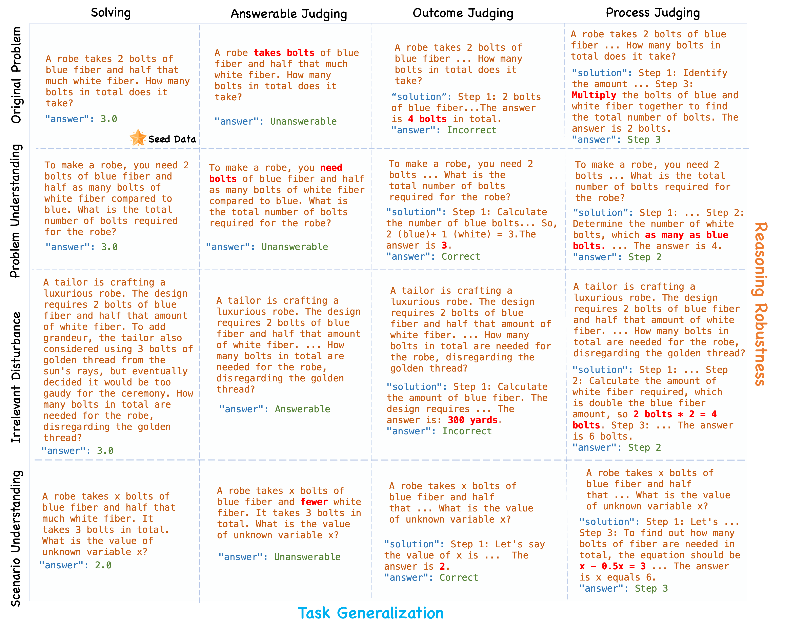 
</td>
<td style="width: 70%">
<strong><a href="https://arxiv.org/pdf/2407.08733" target="_blank">Is Your Model Really A Good Math Reasoner? Evaluating Mathematical Reasoning with Checklist</a></strong> - <em>ICLR 2025</em>  
Zihao Zhou*, Shudong Liu*, Maizhen Ning, Wei Liu, Jindong Wang, Derek F. Wong, Xiaowei Huang, Qiufeng Wang, Kaizhu Huang.
</td>
</tr>
</table>

<table style="border-collapse: collapse;">
<tr>
<td style="width: 30%">
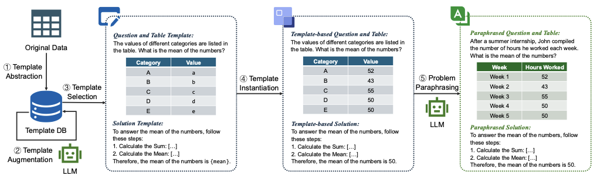 
</td>
<td style="width: 70%">
<strong>Template-Driven LLM-Paraphrased Framework for Tabular Math Word Problem Generation</strong> - <em>AAAI 2025</em>  
Xiaoqiang Kang*, Zimu Wang*, Xiaobo Jin, Wei Wang, Kaizhu Huang, Qiufeng Wang.
</td>
</tr>
</table>

<table style="border-collapse: collapse;">
<tr>
<td style="width: 30%">
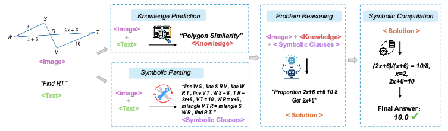 
</td>
<td style="width: 70%">
<strong>GNS: Solving Plane Geometry Problems by Neural-Symbolic Reasoning with Multi-Modal LLMs</strong> - <em>AAAI 2025</em>  
Maizhen Ning*, Zihao Zhou*, Qiufeng Wang, Xiaowei Huang, Kaizhu Huang.
</td>
</tr>
</table>

<table style="border-collapse: collapse;">
<tr>
<td style="width: 30%">
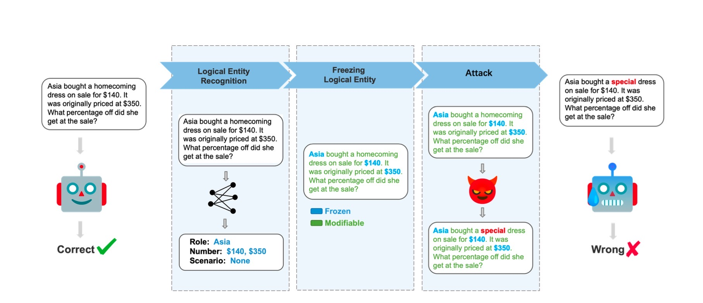 
</td>
<td style="width: 70%">
<strong><a href="https://arxiv.org/pdf/2309.01686.pdf" target="_blank">MathAttack: Attacking Large Language Models Towards Math Solving Ability</a></strong> - <em>AAAI 2024</em>  
Zihao Zhou, Qiufeng Wang, Mingyu Jin, Jie Yao, Jianan Ye, Wei Liu, Wei Wang, Xiaowei Huang, Kaizhu Huang.
</td>
</tr>
</table>

<table style="border-collapse: collapse;">
<tr>
<td style="width: 30%">
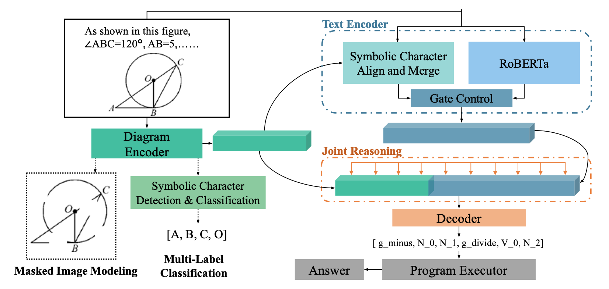 
</td>
<td style="width: 70%">
<strong><a href="https://dl.acm.org/doi/10.1145/3581783.3612570" target="_blank">A Symbolic Characters Aware Model for Solving Geometry Problems</a></strong> - <em>ACM MM 2023</em>  
Maizhen Ning, Qiufeng Wang, Kaizhu Huang, Xiaowei Huang.
</td>
</tr>
</table>

<table style="border-collapse: collapse;">
<tr>
<td style="width: 30%">
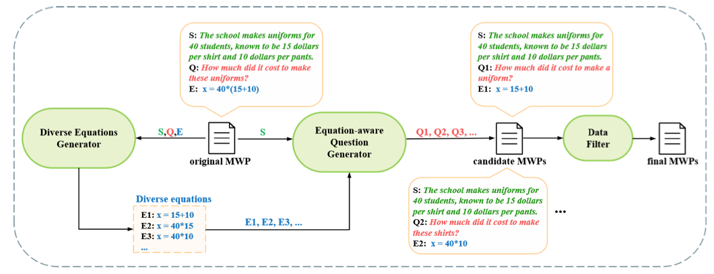 
</td>
<td style="width: 70%">
<strong><a href="https://aclanthology.org/2023.findings-acl.705/" target="_blank">Learning by Analogy: Diverse Questions Generation in Math Word Problem</a></strong> - <em>ACL Findings 2023</em>  
Zihao Zhou*, Maizhen Ning*, Qiufeng Wang, Jie Yao, Wei Wang, Xiaowei Huang, Kaizhu Huang.
</td>
</tr>
</table>

<table style="border-collapse: collapse;">
<tr>
<td style="width: 30%">
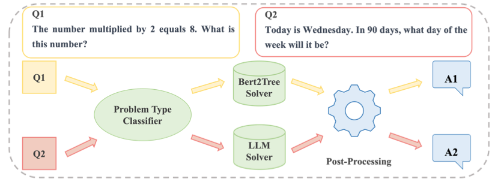 
</td>
<td style="width: 70%">
<strong><a href="https://arxiv.org/pdf/2308.13844.pdf" target="_blank">Solving Math Word Problem with Problem Type Classification</a></strong> - <em>NLPCC 2023</em>  
Jie Yao, Zihao Zhou, Qiufeng Wang.
</td>
</tr>
</table>

* * *

# Awards
2nd Place in NLPCC 2023 Competition: [Math Word Problem Solving](https://github.com/2003pro/CNMWP)

* * *

# Members
## Leader

    <table>
        <tr>
            <td style="text-align: center; border: none;"> <a href="https://www.xjtlu.edu.cn/zh/departments/academic-departments/electrical-and-electronic-engineering/staff/qiufeng-wang" target="_blank">Dr. Qiufeng Wang</a></td>
        </tr>
    </table>

## PhD Students

    <table>
        <tr>
            <td style="text-align: center; border: none;">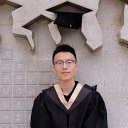 <a href="https://github.com/ning-mz" target="_blank">Maizhen Ning</a></td>
            <td style="text-align: center; border: none;">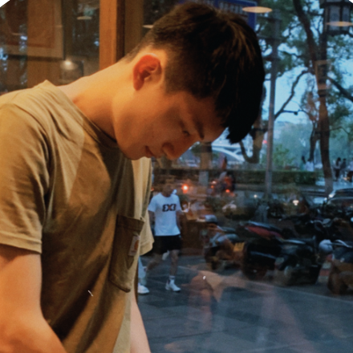 <a href="https://zhouzihao501.github.io/" target="_blank">Zihao Zhou</a></td>
            <td style="text-align: center; border: none;">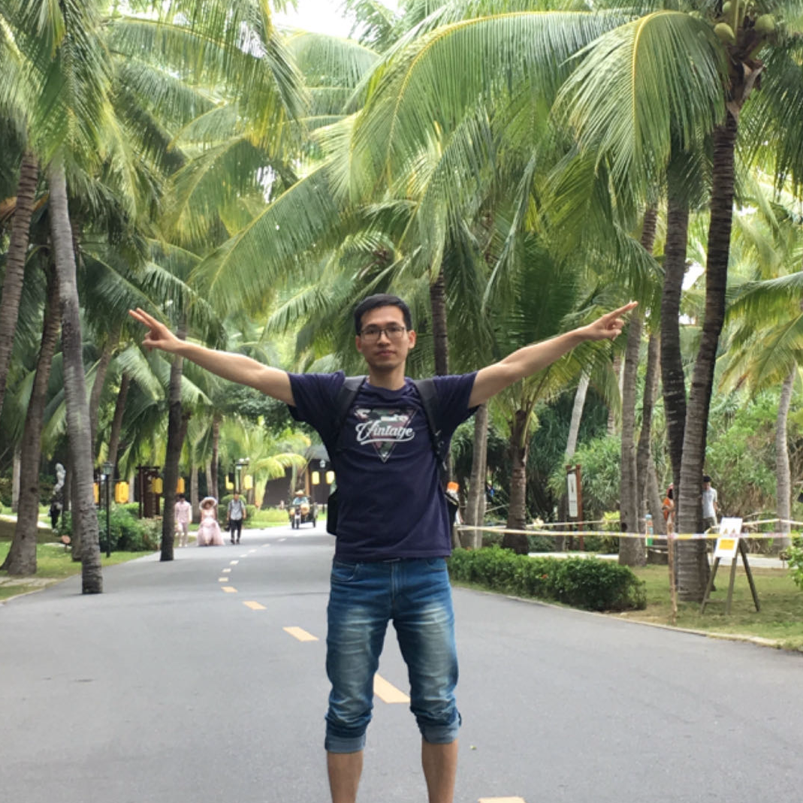 <a href="https://github.com/jason8kang" target="_blank">Xiaoqiang Kang</a></td>
            <td style="text-align: center; border: none;">Qi Lu</td>
        </tr>
    </table>

## Master Students

Jie Yao

* * *

  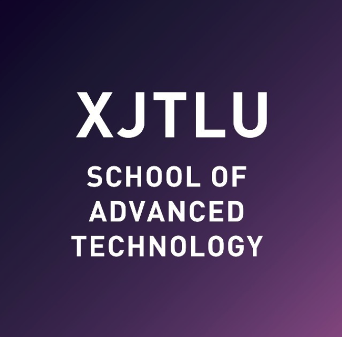

